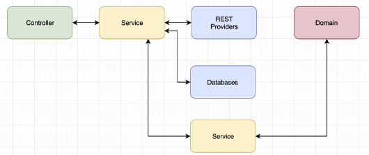
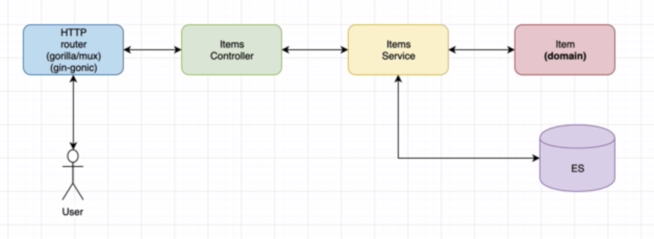
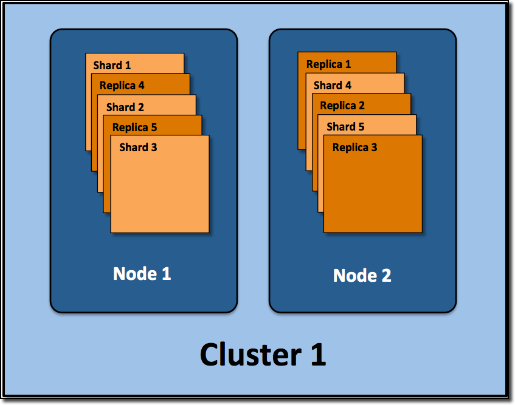
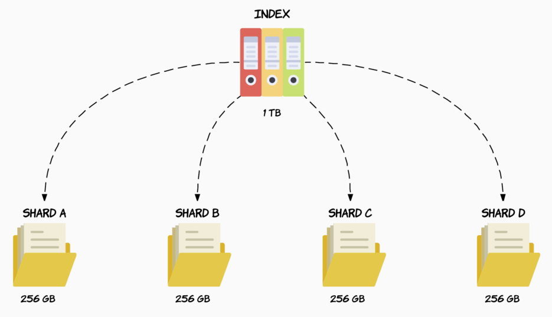
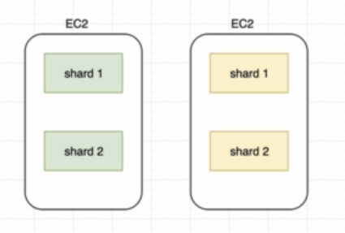

# bookstore_items-api

Check https://medium.com/@hatajoe/clean-architecture-in-go-4030f11ec1b1

## The MVC Architecture



## The Items API Design



## About Elastic Search

Elasticsearch provides real-time search and analytics for all types of data, **structured or unstructured**, text, numerical, or geospatial data.

Elasticsearch can efficiently store and index it in a way that supports fast searches at scale. Elasticsearch handle data in a wide variety of use cases:

- Add a search box to an app or website
- Store and analyze logs, metrics, and security event data
- Use machine learning to automatically model the behavior of your data in real time
- Automate business workflows using Elasticsearch as a storage engine
- Manage, integrate, and analyze spatial information using Elasticsearch as a geographic information system (GIS)
- Store and process genetic data using Elasticsearch as a bioinformatics research tool

Elasticsearch is part of the [Elastic Stack](https://www.elastic.co/guide/index.html)

### Elastic Search (ES) - A few words about shards & replication



#### Cluster

An ES cluster consists of 1 or more nodes and is identified by its cluster name.

#### Node

A single ES instance. In most environments, each node runs on a separate virtual machine.

#### Index

An index is a collection of documents.

#### Primary Shards

When you create an index (an index is automatically created when you index the 1st doc as well) you can define how many shards it will be composed of.

If you don't specify a number it will have the default number of shards: 5 primaries.

The below CURL command means that elasticsearch will create 4 primary shards that will contain your whole data (+ 2 replica)

```bash
curl -X PUT "localhost:9200/twitter?pretty" -H 'Content-Type: application/json' -d '
{
    "settings" : {
        "index" : {
            "number_of_shards" : 4
        }
    }
}'
```

If you have 1TB of storage on your node, your index would be split in 4 equals shards as illustrated below



Note that the **shard number has to be set at the creation of the index**. If not, ES creates 5 shards.
The number of shards to be used by an index **cannot be modified later on**, if you want to do so, you will have to create a new index with the number of shards that you want, then **move your data over to the new index**.

Every time you **index a document**, elasticsearch will decide which primary shard is supposed to hold that document.

Having multiple shards does help taking advantage of **parallel processing on a single machine**, but the whole point is that if we start another elasticsearch instance on the same cluster, **the shards will be distributed in an even way over the cluster**.

#### Replica Shards

Like primary shards, the number of replicas is defined when creating an index.

```bash
curl -X PUT "localhost:9200/twitter?pretty" -H 'Content-Type: application/json' -d '
{
    "settings" : {
        "index" : {
            "number_of_shards" : 4,
            "number_of_replica" : 2,
        }
    }
}'
```

The **default number of replicas is 1 per shard**

A replica shard **cannot be allocated to the same node as its primary shard**.

**Replication** serves 2 purposes:

- Provide **high availability** in case nodes or shards fail.
- The other side benefit of replication is **increased performance** for search queries as searches can be executed on all replicas in parallel, meaning that replicas are actually part of the cluster’s searching capabilities.

The main difference between a **primary** and a **replica shard** is that **only the primary shard can accept indexing requests**. But Both replica and primary shards can serve **querying requests**.

Replicas are used for **search performance and failover**, and **can be added or removed at any time**.



A **replication group** refers to a primary shard and its replica.

### Configuring the number of primary shards & replicas

In case you're running a cluster, you need to ensure that your system is resilient, that is to say if a node goes down, you must ensure that you won't lose any data and that the system keeps running seamlessly.

Once a primary shard goes down, its replica becomes primary until the node that had left is backed up and synchronized with the other shards, as write operations most likely happened while the node was down. Then, the replicas is reassigned.

### Elastic Search Integration


The items API uses the go module: [github.com/olivere/elastic](https://github.com/olivere/elastic)

Here's the wiki: [https://github.com/olivere/elastic/wiki](https://github.com/olivere/elastic/wiki)

### Elastic Search documentation

[Elastic Search documentation](https://www.elastic.co/guide/en/elasticsearch/reference/7.8/elasticsearch-intro.html)

### Elastic Search: A simple case using CURL

First, we create an index with a **PUT** request against port **9200** ...

```bash
curl -X PUT "localhost:9200/items?pretty" -H 'Content-Type: application/json' -d'
{
    "settings" : {
        "index" : {
            "number_of_shards" : 3,
            "number_of_replicas" : 2
        }
    }
}
'
```

Then, we perform a **GET** request ...

```bash
curl -X GET "localhost:9200/items?pretty"

```

```json
{
  "items": {
    "aliases": {},
    "mappings": {},
    "settings": {
      "index": {
        "creation_date": "1589473993826",
        "number_of_shards": "4",
        "number_of_replicas": "2",
        "uuid": "qnl_xKPZSr2fLN0XcObEbQ",
        "version": {
          "created": "7070099"
        },
        "provided_name": "items"
      }
    }
  }
}
```

then a **search** request

```bash
curl -X GET "localhost:9200/twitter/_search?pretty"
```

```json
{
  "took": 149,
  "timed_out": false,
  "_shards": {
    "total": 4,
    "successful": 4,
    "skipped": 0,
    "failed": 0
  },
  "hits": {
    "total": {
      "value": 0,
      "relation": "eq"
    },
    "max_score": null,
    "hits": []
  }
}
```

## Elastic Search with Go

### Create index

Important note: **Don't create index in the init() function**, otherwise, the program will try to recreate the index at each deployment

```go
// Create a new index.
mapping := `{
	"settings":{
		"number_of_shards":1,
		"number_of_replicas":0
	},
	"mappings":{
		"properties":{
			"tags":{
				"type":"keyword"
			},
			"location":{
				"type":"geo_point"
			},
			"suggest_field":{
				"type":"completion"
			}
		}
	}
}`

ctx := context.Background()
createIndex, err := client.CreateIndex("twitter").BodyString(mapping).Do(ctx)
if err != nil {
    // Handle error
    panic(err)
}
if !createIndex.Acknowledged {
    // Not acknowledged
}
```

### Test if index exists

```go
// Check if the index called "twitter" exists
exists, err := client.IndexExists("twitter").Do(context.Background())
if err != nil {
    // Handle error
}
if !exists {
    // Index does not exist yet.
}
```

### Add a document to an index

[wiki here](https://github.com/olivere/elastic/wiki/Index)

```go
type Tweet struct {
	User     string        `json:"user"`
	Message  string        `json:"message"`
	Retweets int           `json:"retweets"`
	Image    string        `json:"image,omitempty"`
	Created  time.Time     `json:"created,omitempty"`
	Tags     []string      `json:"tags,omitempty"`
	Location string        `json:"location,omitempty"`
	Suggest  *SuggestField `json:"suggest_field,omitempty"`
}

// Index a tweet (using JSON serialization)
ctx := context.Background()
tweet1 := Tweet{User: "olivere", Message: "Take Five", Retweets: 0}
put1, err := client.Index().
    Index("twitter").
    Type("tweet").
    Id("1").
    BodyJson(tweet1).
    Do(ctx)
if err != nil {
    // Handle error
    panic(err)
}
fmt.Printf("Indexed tweet %s to index %s, type %s\n", put1.Id, put1.Index, put1.Type)

// Index a second tweet (by string)
tweet2 := `{"user" : "olivere", "message" : "It's a Raggy Waltz"}`
put2, err := client.Index().
    Index("twitter").
    Type("tweet").
    Id("2").
    BodyString(tweet2).
    Do(ctx)
if err != nil {
    // Handle error
    panic(err)
}
fmt.Printf("Indexed tweet %s to index %s, type %s\n", put2.Id, put2.Index, put2.Type)
```

### Get document from an index

```go
// Get tweet with specified ID
ctx := context.Background()
get1, err := client.Get().
    Index("twitter").
    Type("tweet").
    Id("1").
    Do(ctx)
if err != nil {
    // Handle error
    panic(err)
}
if get1.Found {
    fmt.Printf("Got document %s in version %d from index %s, type %s\n", get1.Id, get1.Version, get1.Index, get1.Type)
}
```

### Delete a document from an index

```go
// Delete tweet with specified ID
ctx := context.Background()
res, err := client.Delete().
    Index("twitter").
    Type("tweet").
    Id("1").
    Do(ctx)
if err != nil {
    // Handle error
    panic(err)
}
if res.Found {
    fmt.Print("Document deleted from from index\n")
}
```

### Search a document in an index

```go
// Search with a term query
ctx := context.Background()
termQuery := elastic.NewTermQuery("user", "olivere")
searchResult, err := client.Search().
    Index("twitter").   // search in index "twitter"
    Query(termQuery).   // specify the query
    Sort("user", true). // sort by "user" field, ascending
    From(0).Size(10).   // take documents 0-9
    Pretty(true).       // pretty print request and response JSON
    Do(ctx)             // execute
if err != nil {
    // Handle error
    panic(err)
}

// searchResult is of type SearchResult and returns hits, suggestions,
// and all kinds of other information from Elasticsearch.
fmt.Printf("Query took %d milliseconds\n", searchResult.TookInMillis)

// Each is a convenience function that iterates over hits in a search result.
// It makes sure you don't need to check for nil values in the response.
// However, it ignores errors in serialization. If you want full control
// over the process, see below.
var ttyp Tweet
for _, item := range searchResult.Each(reflect.TypeOf(ttyp)) {
    t := item.(Tweet)
    fmt.Printf("Tweet by %s: %s\n", t.User, t.Message)
}

// TotalHits is another convenience function that works even when something goes wrong.
fmt.Printf("Found a total of %d tweets\n", searchResult.TotalHits())

// Here's how you iterate through the search results with full control over each step.
if searchResult.Hits.TotalHits.Value > 0 {
    fmt.Printf("Found a total of %d tweets\n", searchResult.Hits.TotalHits.Value)

    // Iterate through results
    for _, hit := range searchResult.Hits.Hits {
        // hit.Index contains the name of the index

        // Deserialize hit.Source into a Tweet (could also be just a map[string]interface{}).
        var t Tweet
        err := json.Unmarshal(hit.Source, &t)
        if err != nil {
            // Deserialization failed
        }

        // Work with tweet
        fmt.Printf("Tweet by %s: %s\n", t.User, t.Message)
    }
} else {
    // No hits
    fmt.Print("Found no tweets\n")
}
```
